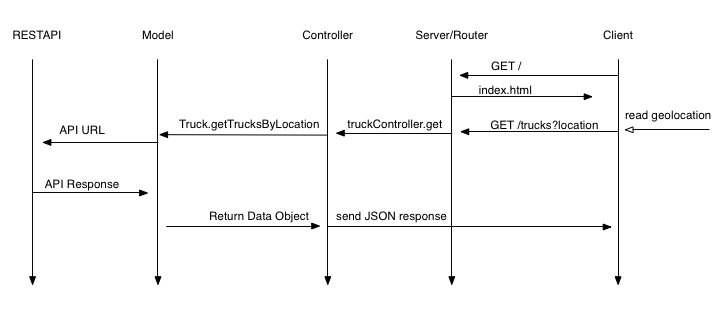
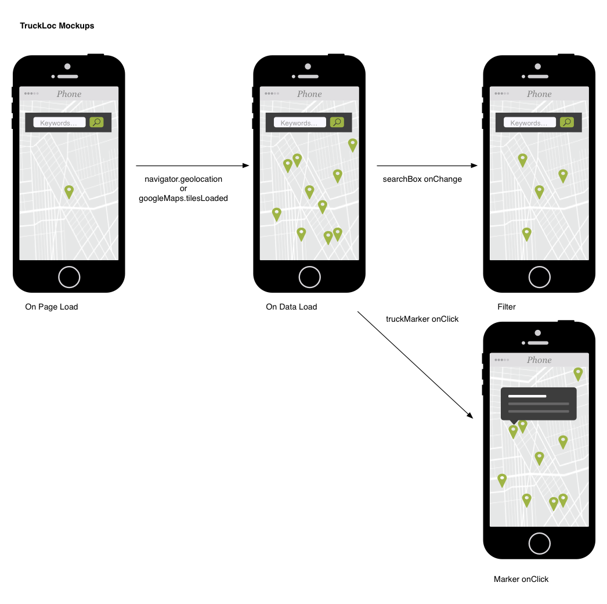

## Food Truck Locator

A location aware full-stack application to search and filter nearby food trucks in the San Francisco area.

### Usage

Browse to address and see food trucks located in your area. (For use in SF area). The primary interface is a around a map view.  The application will automatigically read your location and query for trucks near your location.

Once truck locatin are loaded you can filter them by entering text in the search box. Alternatively, auto-complete will populate the available tags for you to select from.  If you are interested in getting more information, just click on markers, the callout will show the truck details for the truck you highlighted.

### Architecture

##### Back-end

The application is composed of a back-end that built with Node and Express. It is built as a lightweight wrapper on the Socrata API. The current architecture does not use a database although one can be easily added at the models layer.



##### Model Signature
###### Truck Model:

Truck model objects are created from API data and are used internally by the application

| Name  |  Type |  Description |
|---|---|---|
| `props.objectid`  | string  | id provided by api  |
| `props.applicant`  |  string |  name of business |
| `props.facilityType`  | string  | type of food truck  |
| `props.locationDescription` |  string | human readable approximation of address  |
| `props.foodItems`  |  string | summary of products offered  |
| `props.latitude`  | string  |  geolocation:latitude of business |
| `props.longitude`  |  string | geolocation:longitude of business  |
| `props.daysHours`  |  string | human readable description of hours of operation  |
| `props.location` | object  |  geospatial point object of the business location |
| `props.tags` | object  |  list of terms representing products offered |

See [additional functions](./documentation/Truck.html) used by Truck


##### API Endpoints Table

| Method | Route  | Params |Query String  |  Response Data | Handler |
|---|---|---|---|---|---|
|  GET | /  |  NA | index.html |  |
|  GET | /trucks  | NA | latitude, longitude, radius, limit  | { trucks: [], tags: {}}  | [getTrucksByLocation](./documentation/Truck.getTrucksByLocation.html) |

##### Front-end

The front-end is built with React and Redux utilizing HTML5 Location API with Google Maps.



###### Application State

| Property  |  Type |  Sub-Props | Description
|---|---|---|---|
| user  | object  |  location, location.latitude, location.longitude | user location object |
| search  |  string |   | state of searchBox|
| activeTruck  |  object |  [Truck Model](#truck-model) | Currently higlighted Truck|
| data  |  object  |  all, filtered | Collections of truck models |
| view  | object  |  zoom, position, boxPoints | values to control map view|

###### Application Actions

| Event  | Actions  | State  | Description  |
|---|---|---|---|
| onPageLoad  |  getCurrentLocation, getTrucksByLocation |  user.location, data.all |  When the application loads the page it will get location and request data from API |
| onLocationChange | getTrucksByLocation, repositionMap | data.all, position, boxPoints | When location changes significantly a new set of data is fetched |
| onMapLoad  |  transmitBoxDimensions, filterByGeolocation | data.filter  |  filter the map to have only markers in visible space |
| search.onChange  |  filterByFoodType |  search, data.filter  |  actively update data.filtered based on text in search box, remove non-matching markers, re-render |
| marker.onClick  |  showTruckDetails |  activeTruck | sets the activeTruck to the clicked target  |
| map.onDragEnd  |  repositionMap, transmitMapDimensions, filterByGeolocation, getTrucksByLocation |  position, boxPoints |  repositions the map based on user input|
| map.onPinch, mouse.onScroll  |  repositionMap, transmitMapDimensions |  zoom, boxPoints | Resize the map view based on user input  |

### Install

To install the source and add to the project you need to have node & npm installed.

Assuming you have node, you'll want to clone the repo with:

```bash
git clone https://github.com/urbantumbleweed/food-truck-locator.git
```
This will create a directory for called, `food-truck-locator`.  You'll want to `cd` into that directory and install dependencies. Do that with the following commands.

```bash
cd food-truck-locator
npm install
```

Spin up the server with:
```bash
npm start
```

### Tests

Mocha tests has been authored covering all public and private methods in the Truck model. You can run the tests with:

```bash
npm test
```

Note: Express routing and controller integration have been tested with a sample script found at `./test/routeTester.js`.  

Running the `routeTester` script will initiate a server that will make requests to the application webserver on an interval. To use go into `routeTester` and ensure the IP address is correct.  Once it is configured, you can start routeTester with:

```bash
npm run testRoutes
```
